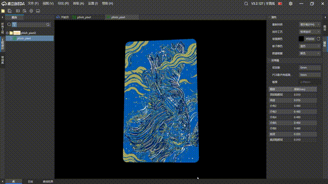

# PCB Art

灵感来源：[OSHWhub - 星空PCB画](https://oshwhub.com/sytnocui/star-pcb-drawing)

将任意图片转化为 PCB 各层的光绘文件，直接导入 [立创 EDA](https://easyeda.com/) 编辑或下单打板。输出的 PCB 板为**银行卡尺寸**（54 mm × 85.6 mm），带**圆角**，可以直接当卡片用。

本仓库的主要工作在于整理了代码逻辑，让其更加清晰而且可维护，各个层和颜色之间的对应关系也更好

|                                     |                                       |
|-------------------------------------|---------------------------------------|
|  |  
|

## 原理

PCB 的每一层（铜皮、阻焊、丝印）颜色不同，叠加后能呈现多种视觉效果。本项目将图片中的颜色映射到 PCB 的物理结构上：

| Key                | 含义          | 正面观感 | 背光观感   |
|--------------------|-------------|------|--------|
| `mask_solid`       | 有阻焊，无铜      | 深色底  | 亮（透光）  |
| `mask_over_copper` | 有阻焊，有铜      | 浅色底  | 暗（铜挡光） |
| `backlit_tinted`   | 正面无阻焊，背面有阻焊 | 半透光  | 带色调    |
| `backlight`        | 双面无覆盖（纯基板）  | —    | 明亮透光   |
| `pad`              | 裸铜焊盘        | 金属色  | 不透光    |
| `silkscreen`       | 白色丝印        | 白色文字 | 不透光    |

每种颜色对应 PCB 的不同层组合（正面阻焊 / 正面铜皮 / 正面丝印 / 背面阻焊），最终合并输出 4 张二值图。

## Pipeline

全部流程在 `pipline_me.ipynb` 中，按 cell 顺序执行：

```
原图 → 颜色简化 → 颜色分离 → 颜色合并 → 裁剪+圆角 → EasyEDA JSON 输出
```

1. **颜色简化** — 缩放原图，将每个像素映射到最近的预定义颜色（欧氏距离）
2. **颜色分离** — 按颜色拆分为 6 张独立遮罩
3. **颜色合并** — 按公式合并为 PCB 各层二值图（白=有内容，黑=无内容）
4. **裁剪+圆角** — 裁为银行卡比例，四角加圆角（R3.18mm）
5. **EasyEDA JSON 输出** — 转为立创 EDA 可直接打开的 JSON，打包为 zip

项目根目录下还有独立脚本版本（`01颜色简化.py` ~ `04平滑处理.py`），功能与 notebook 早期版本一致。

## 使用方法

### 环境准备

```bash
# 如果使用 uv
uv sync

# 如果使用 pip
pip install opencv-python numpy matplotlib jupyter
```

### 运行

1. 将图片放入 `input_img/` 目录
2. 打开 `pipline_me.ipynb`，修改第一个 cell 中的 `INPUT_IMAGE_NAME`
3. 按 cell 顺序执行
4. 裁剪步骤会弹出交互式滑块，拖动选择保留区域
5. 最后一个 cell 生成三个 zip 文件到 `output_img/` 目录

### 调整精细度

修改第一个 cell 中的 `SCALE_FACTOR`：

| 值    | 每像素物理尺寸  | 说明                 |
|------|----------|--------------------|
| 0.5  | ~0.17mm  | 粗糙，文件小             |
| 0.75 | ~0.11mm  | **推荐**，平衡精细度和可制造性  |
| 1.0  | ~0.085mm | 最精细，部分细节可能超出常规工艺极限 |

PCB 总尺寸固定为 54×85.6mm，`SCALE_FACTOR` 只影响精细度。

### 导入立创 EDA

1. 打开 [立创 EDA 标准版](https://easyeda.com/editor)
2. 文件 → 导入 → 嘉立创 EDA 标准版
3. 选择生成的 zip 文件

## 输出说明

最后一个 cell 生成三种方案的 zip 文件：

| 方案               | 方法     | 精度      | 文件大小 |
|------------------|--------|---------|------|
| `*_pixel.zip`    | 逐像素    | 100% 还原 | 最大   |
| `*_external.zip` | 仅外轮廓   | 空洞会丢失   | 最小   |
| `*_tree.zip`     | 外轮廓+空洞 | 保留空洞    | 中等   |

推荐使用 **pixel** 方案（精度最高）。

### 层对应关系

| 文件             | EasyEDA 层        | 说明       |
|----------------|------------------|----------|
| topCu.png      | TopLayer (1)     | 正面铜皮     |
| topMask.png    | TopSolder (7)    | 正面阻焊（负片） |
| topSilk.png    | TopSilk (3)      | 正面丝印     |
| bottomMask.png | BottomSolder (8) | 背面阻焊（负片） |

阻焊层为负片：输出中绘制的区域 = 没有阻焊漆 = 露出铜皮/基板。

## 打板注意事项

- **层数**：选单面板（1层）即可，本项目没有背面铜皮
- **阻焊颜色**：下单时选的颜色就是成品正面看到的板子底色
- **最小线宽**：`SCALE_FACTOR=0.75` 时每像素约 4.5mil，建议选嘉立创精细工艺（4mil）

## 许可证

MIT
